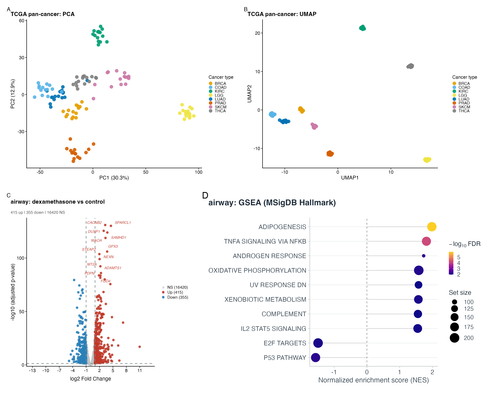

<!--
  PLACEHOLDERS TO COMPLETE before submission (search for "TODO"):
    - ^1  affiliation (institution, department, city, country)
    - ORCID for the author
    - corresponding-author e-mail
    - Funding, Acknowledgements, Author contributions
    - Zenodo DOI (minted at release)
  Render to PDF/DOCX with, e.g.:
    pandoc paper/paper.md --citeproc -o paper/paper.pdf
-->

^1^ *TODO: affiliation — institution, department, city, country.*
ORCID: *TODO: 0000-0000-0000-0000.*

^\*^ Correspondence: *TODO: e-mail.*

---

## Abstract

**Background.** Bulk RNA-sequencing is a routine assay, but turning a count
matrix into biological insight still requires stitching together many
specialised tools for quality control, differential expression, dimensionality
reduction, functional enrichment, co-expression networks, and activity
inference. In practice this is done either with bespoke scripts that are hard to
reuse, or with interactive web applications that are convenient but often act as
black boxes, cover only part of the workflow, and make it difficult to recover
exactly what was run.

**Results.** We present RNAflow, an open-source platform that covers the bulk
RNA-seq analysis workflow end to end — from a raw count matrix and sample
metadata through differential expression (DESeq2), sample-level exploration
(PCA / UMAP), multi-contrast comparison, functional enrichment (GSEA and
over-representation analysis), weighted gene co-expression network analysis
(WGCNA), transcription-factor and pathway activity inference (decoupleR),
per-sample gene-set signatures (GSVA), and optional AI-assisted interpretation.
RNAflow is distributed not as a monolithic script but as a properly engineered R
package: analysis and figure logic live in a pure, unit-tested function layer
(more than 440 automated tests), and the Shiny user interface is a thin wrapper
over that API. Every analysis can be saved as a portable session and exported as
a runnable R script, a Methods paragraph, and a self-contained HTML report, and
the whole environment is pinned in a Docker image, so a point-and-click
exploration always maps back to a reproducible record.

**Conclusions.** RNAflow lowers the barrier to a complete, modern bulk RNA-seq
analysis while keeping the result transparent and reproducible. It is available
under the MIT licence at <https://github.com/KmBioChemo/RNAflow>.

**Keywords:** RNA-seq; differential expression; functional enrichment;
co-expression networks; reproducibility; Shiny; R.

## Introduction

RNA-sequencing is the standard method for genome-wide transcript quantification,
and a bulk RNA-seq experiment now routinely feeds a long analytical chain:
quality control, normalisation, differential-expression testing, low-dimensional
visualisation, functional enrichment, and increasingly network- and
knowledge-based interpretation. Each step is well served by mature software —
DESeq2 for differential expression [@deseq2], fgsea and clusterProfiler for
enrichment [@fgsea; @clusterprofiler], WGCNA for co-expression networks
[@wgcna], decoupleR for regulator and pathway activity [@decoupler], and GSVA
for per-sample signatures [@gsva] — but assembling them into a coherent analysis
remains the analyst's responsibility.

Two broad strategies dominate in practice, and each has a characteristic
weakness. The first is a bespoke analysis script or notebook: maximally flexible,
but written for one project, rarely reused, and easy to get subtly wrong. The
second is an interactive application. A number of excellent web and Shiny tools
exist for exploratory RNA-seq analysis — iDEP [@idep], DEBrowser [@debrowser],
pcaExplorer [@pcaexplorer], GeneTonic [@genetonic], and ExpressAnalyst
[@expressanalyst], among others. These lower the barrier to entry
dramatically, but they tend to share some limitations: many are hosted web
services that require uploading data to a third party; most cover a subset of the
workflow (for example DE and enrichment, but not co-expression or activity
inference); and, crucially, the interactive session is often difficult to turn
back into an exact, re-runnable record of what was done. Reproducibility — the
ability to regenerate a figure or a table from the same inputs months later — is
frequently an afterthought rather than a design goal.

RNAflow is designed to address these gaps simultaneously. It has three guiding
principles. **(i) Breadth:** it covers the workflow from count matrix to
functional and network-level interpretation in a single, internally consistent
tool, so an analyst does not have to leave the application to run enrichment,
build a co-expression network, or score signatures. **(ii) Reproducibility:**
every analysis is a saveable session that can be exported as a runnable script, a
Methods paragraph, and a self-contained report, and the software stack is pinned
in a container, so the convenience of a graphical interface never comes at the
cost of a transparent record. **(iii) Software engineering:** RNAflow is built as
a tested R package with a pure, reusable function layer, not a single large
`app.R`, so its components can be scripted, tested, and maintained independently
of the user interface. This article describes RNAflow's design and demonstrates
it on two published human datasets of contrasting complexity.

## Implementation

### Software architecture and design

RNAflow is an R package built on Shiny [@shiny] and bslib [@bslib]. Its central
design decision is a strict separation between *pure* and *impure* code. All
analysis and figure logic is implemented as ordinary R functions that take data
in and return data or graphics out, with no dependence on the Shiny runtime;
these functions (prefixed `read_*`, `run_*`, `fig_*`, `compute_*`) form a public
API that can be used from any script. The interactive layer is a set of Shiny
modules (prefixed `mod_*`), each a thin wrapper that wires user inputs to the
pure functions. This architecture makes the scientific core independently
testable: the package ships more than 440 automated unit tests (`testthat`)
covering the analysis and figure functions, runs continuous-integration checks,
validates cleanly under `R CMD check`, and publishes a reference website via
`pkgdown`. Input is validated strictly and fails fast with explicit messages
(negative counts, duplicate gene identifiers, sample/metadata mismatches, and so
on), so that user error surfaces immediately rather than as a confusing
downstream failure.

### Differential expression

Differential expression is computed with DESeq2 [@deseq2]. The user selects the
design variable and, optionally, covariates to adjust for (for example a batch or
a subject identifier), which are placed ahead of the variable of interest in the
model formula. Effect sizes can be shrunk with the apeglm estimator [@apeglm].
RNAflow deliberately keeps inference and effect-size estimation separate:
p-values and the test statistic always come from the unshrunken Wald test, while
shrinkage only adjusts the reported log-fold-change for ranking and
visualisation, which guarantees a well-defined test statistic even when apeglm is
used. Beyond a single user-specified contrast, RNAflow can run **all pairwise
comparisons** of a multi-level design variable from a single model fit
(`run_deseq2_all_pairs`), adding each contrast to a named store — convenient when
a design has many groups and every pairwise difference is of interest.

### Sample-level exploration

For visualisation and clustering, counts are transformed with the
variance-stabilising transformation or regularised log (DESeq2). Samples are
projected with principal-component analysis, a three-dimensional interactive PCA,
and UMAP [@umap], each colourable by any metadata variable and with an optional
toggle for on-plot sample labels. These low-dimensional maps are the first place
a mislabelled sample or an unwanted batch effect becomes visible, before it
contaminates downstream results.

### Multi-contrast comparison

When several contrasts have been computed, RNAflow compares them directly:
significant-gene set overlaps (Venn and UpSet [@upsetr] diagrams), a grid of
volcano plots, a log-fold-change heatmap across contrasts, and an alluvial view
of how genes move between up-, down-, and not-significant across contrasts. This
turns a collection of separate DE runs into a single comparative picture.

### Functional enrichment

RNAflow provides both major flavours of enrichment. Gene-set enrichment analysis
(GSEA) is computed over the whole ranked gene list with fgsea [@fgsea; @gsea],
and over-representation analysis (ORA) tests the significant genes with
clusterProfiler [@clusterprofiler]. Gene sets include the MSigDB Hallmark and
curated collections [@hallmark; @msigdbr], Gene Ontology, KEGG, and Reactome
[@reactomepa]. Results are shown as dot- and bar-plots, running-enrichment
curves, and both a static and an interactive network map of shared-gene overlap
between enriched terms.

### Co-expression networks

Weighted gene co-expression network analysis is available through WGCNA
[@wgcna]: soft-threshold selection, module detection, module–trait correlation
against sample metadata, per-module hub genes, and per-module functional
enrichment. This exposes coordinated programmes of gene expression and relates
them to phenotype.

### Regulator and pathway activity

RNAflow infers upstream activity with decoupleR [@decoupler], estimating
transcription-factor activity from the CollecTRI regulon [@collectri] and
pathway activity with PROGENy [@progeny]; the underlying prior-knowledge networks
are retrieved through OmniPath [@omnipath]. This moves interpretation from
individual genes to the regulators and pathways that plausibly drive them.

### Per-sample signatures

Gene-set variation analysis [@gsva] scores every sample against a chosen gene-set
collection, producing a sets-by-samples signature matrix (via GSVA or ssGSEA)
that is displayed as an annotated heatmap. Unlike contrast-based enrichment, this
yields a per-sample activity profile suitable for stratifying heterogeneous
cohorts.

### AI-assisted interpretation

As an optional aid, RNAflow can assemble a structured prompt from a contrast (top
genes, enrichment terms) and query a large language model to draft a narrative
interpretation. This feature is strictly opt-in: it is inactive unless the user
supplies their own API key, which is held only for the session and never stored
or committed. Its output is explicitly framed as a hypothesis-generating draft to
be verified against the primary results and the literature, not as an
authoritative conclusion.

### Reproducibility and export

Reproducibility is a first-class feature rather than an add-on. A complete
analysis — inputs, DE results, contrasts, enrichment, signatures, and settings —
can be saved to a single portable session file and reopened later, with backward
compatibility for older sessions. From any analysis RNAflow generates: a
**runnable R script** that reproduces the pipeline with the package's public
functions; a **Methods paragraph** suitable for a manuscript; and a
**self-contained HTML report** that embeds the figures and requires no external
renderer. To pin the computational environment, the repository ships a Docker
image built on the Bioconductor base image (R 4.5 / Bioconductor 3.22), so the
heavy dependency stack resolves identically on any machine; an optional package
lockfile can pin exact versions on top.

### Figures and bundled data

Every figure function offers an *exploration* mode for interactive work and a
*publication* mode with strict, compact styling ready for a manuscript panel, and
interactive figures use a shared plotly [@plotly] styling for a consistent look;
static figures build on ggplot2 [@ggplot2] and ComplexHeatmap [@complexheatmap].
Two real, published human datasets are bundled for demonstration and testing, and
each is reproducibly regenerated from its Bioconductor source by a script in the
repository: the **airway** dataset [@airway] (a simple two-group,
glucocorticoid-treatment study) and a **TCGA pan-cancer** subset [@gse62944;
@tcga] (a complex eight-cancer-type cohort). Supported organisms are human,
mouse, and rat.

## Results

To demonstrate RNAflow across the difficulty spectrum, we analysed the two
bundled datasets. All results below were produced with RNAflow's public functions
and are reproduced by the figure script in the repository; Figure 1 was generated
directly from that script.

### A simple two-group study

The airway dataset [@airway] measures airway smooth-muscle cells treated with
dexamethasone versus control across four cell lines (eight samples). Modelling
expression as `~ cell + condition` to adjust for the paired cell line and
contrasting dexamethasone against control, RNAflow identified 770 differentially
expressed genes (415 up, 355 down; adjusted *p* < 0.05 and |log2 fold change| >
1) out of 17,190 tested. The most strongly induced genes are canonical
glucocorticoid-response genes (for example *ZBTB16*, *STEAP4*, *ALOX15B*,
*DUSP1*, *SPARCL1*), and GSEA against the MSigDB Hallmark collection returned 19
significantly enriched gene sets (adjusted *p* < 0.05), recovering the expected
anti-inflammatory and metabolic response signature (Figure 1C, D). This confirms
that RNAflow reproduces the established biology of a well-characterised
experiment.

### A complex multi-group study

The TCGA subset comprises 120 tumours evenly sampled from eight molecularly
distinct cancer types (BRCA, LUAD, KIRC, LGG, THCA, PRAD, COAD, SKCM;
18,686 genes) [@gse62944; @tcga]. Here the value of an integrated, multi-group
tool becomes apparent. Principal-component analysis and UMAP both separate the
eight cancer types into clearly resolved clusters (Figure 1A, B; PC1 and PC2
explaining 30.3% and 12.9% of variance), exactly the structure expected from
tissue-of-origin and driver differences. Because the design variable has eight
levels, the all-pairwise mode produces all 28 pairwise contrasts from a single
model fit; a representative example, glioma (LGG) versus lung adenocarcinoma
(LUAD), yields 8,713 significant genes, consistent with the large transcriptional
distance between these tissues. The same cohort feeds directly into WGCNA
co-expression modules and GSVA per-sample signatures within the application,
illustrating that a single loaded dataset supports the full downstream workflow
without leaving the tool.

### Reproducibility

For both analyses, exporting the session produced a runnable R script that
regenerates the DE tables and figures from the original inputs using the
package's public functions, together with a Methods paragraph and a
self-contained HTML report. The reference analysis is therefore not only
demonstrable interactively but recoverable as code — the property that most
distinguishes RNAflow from a purely interactive tool.

{width=100%}

**Figure 1.** *RNAflow applied to two bundled datasets.* **(A)** Principal-
component analysis and **(B)** UMAP of the 120-sample TCGA pan-cancer subset,
coloured by cancer type (colour-vision-deficiency-safe palette); the eight types
form clearly separated clusters. **(C)** Volcano plot of the airway dexamethasone-
versus-control contrast (publication mode), highlighting glucocorticoid-response
genes. **(D)** Gene-set enrichment (MSigDB Hallmark) for the same contrast,
showing normalised enrichment score, set size, and false-discovery rate. All
panels were generated from `paper/make_figures.R`.

## Discussion

RNAflow's contribution is not a new statistical method but an integration:
it brings the standard, best-in-class methods for each analysis step into one
coherent, reproducible, and properly engineered tool. Table 1 summarises how its
scope compares with representative interactive RNA-seq applications. Several
tools cover differential expression, dimensionality reduction, and enrichment
well; RNAflow's distinguishing combination is the inclusion of co-expression
networks, regulator/pathway activity, and per-sample signatures alongside them,
together with first-class reproducibility export and a tested-package
architecture, in a tool that runs locally on the user's own machine.

**Table 1.** Feature comparison with representative interactive bulk RNA-seq
tools. ● present; ○ partial or via a related feature; blank not a focus.
(Feature sets evolve; this reflects the tools' primary published scope.)

| Capability | iDEP | DEBrowser | pcaExplorer | GeneTonic | ExpressAnalyst | **RNAflow** |
|---|:--:|:--:|:--:|:--:|:--:|:--:|
| Differential expression | ● | ● | ○ | ○ | ● | ● |
| QC / diagnostics | ● | ● | ● | | ● | ● |
| PCA / UMAP | ● | ● | ● | ○ | ● | ● |
| Multi-contrast comparison | ○ | ○ | | | ○ | ● |
| GSEA + ORA | ● | ● | ○ | ● | ● | ● |
| Co-expression (WGCNA) | ○ | | | | ○ | ● |
| TF / pathway activity | | | | | ○ | ● |
| Per-sample signatures (GSVA) | | | | | | ● |
| AI-assisted interpretation | | | | | | ● |
| Runnable-script / report export | ○ | ○ | ○ | ○ | ○ | ● |
| Tested, reusable R package | | ● | ● | ● | ○ | ● |
| Runs fully locally / offline | ○ | ● | ● | ● | ● | ● |

The design has clear limitations, which we state plainly. RNAflow analyses
**bulk** RNA-seq only; it is not intended for single-cell or spatial data. It
starts from a **count matrix** and does not perform read alignment or
quantification, which must be done upstream (for example with STAR, Salmon, or
featureCounts). Its outputs are **exploratory and hypothesis-generating**: WGCNA
modules are most reliable with larger sample sizes and should be treated as
hypotheses for small cohorts, enrichment and activity results require independent
validation, and the optional AI interpretation is a drafting aid whose claims
must be checked. RNAflow is a tool for competent exploratory analysis, not a
substitute for expert statistical review of experimental design, batch handling,
and model adequacy. Future directions include broader organism support, a hosted
live demonstration, and additional visualisation types.

## Conclusions

RNAflow provides a complete, integrated, and reproducible route from a bulk
RNA-seq count matrix to differential expression and multi-layered functional
interpretation, packaged as a tested R library with a thin Shiny interface. By
making reproducible export and a clean, reusable API first-class design goals, it
offers the accessibility of an interactive application without sacrificing the
transparency of a scripted analysis.

## Availability and requirements

- **Project name:** RNAflow
- **Project home page:** <https://github.com/KmBioChemo/RNAflow> (documentation:
  <https://KmBioChemo.github.io/RNAflow/>)
- **Archived version:** *TODO: Zenodo DOI (minted at release).*
- **Operating systems:** platform-independent (Linux, macOS, Windows); a Docker
  image is provided.
- **Programming language:** R (≥ 4.4; developed and tested against R 4.5 /
  Bioconductor 3.22).
- **Other requirements:** DESeq2, fgsea, clusterProfiler, WGCNA, GSVA, decoupleR,
  and related Bioconductor packages (installed automatically or via the provided
  Docker image).
- **Licence:** MIT.
- **Any restrictions to use by non-academics:** none.

## Declarations

**Availability of data and materials.** RNAflow and the scripts that generate the
bundled demonstration datasets and Figure 1 are available at
<https://github.com/KmBioChemo/RNAflow>. The demonstration datasets are derived
from public data: the airway dataset [@airway] and the TCGA pan-cancer subset
obtained through GSE62944 [@gse62944; @tcga].

**Competing interests.** The optional AI-interpretation feature queries a
third-party large-language-model API using a key that the user supplies; no data
are sent unless the user opts in. The author declares no other competing
interests. *TODO: confirm.*

**Funding.** *TODO: funding sources, or "This research received no specific
grant."*

**Authors' contributions.** *TODO: e.g., K.M. designed and implemented the
software and wrote the manuscript.*

**Acknowledgements.** *TODO: acknowledgements, if any. RNAflow builds on the
DESeq2, fgsea, clusterProfiler, WGCNA, GSVA, decoupleR, and Bioconductor
projects, whose authors we thank.*

## References
